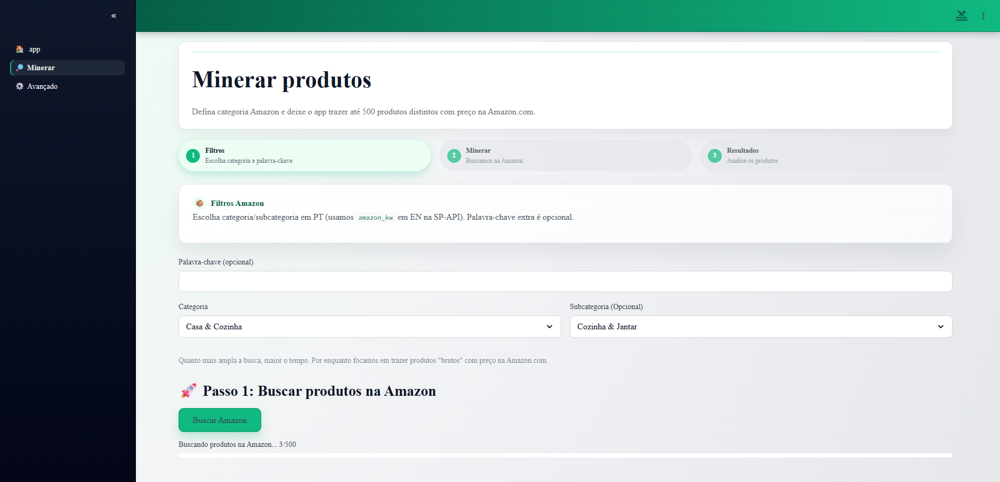
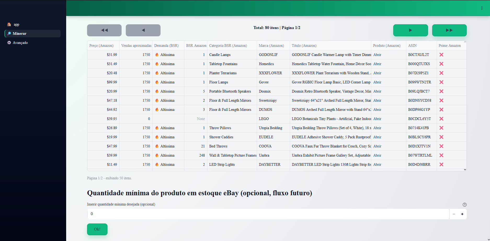
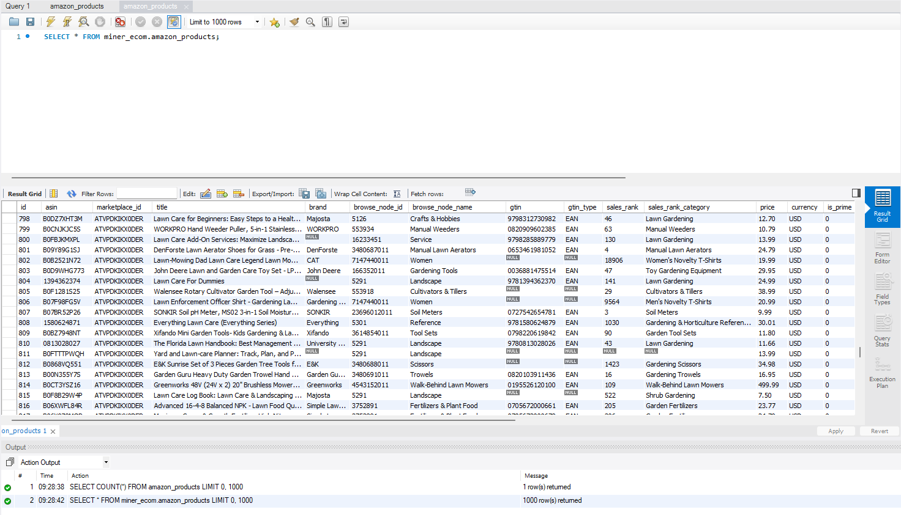

# 🧠 Miner Ecom – Amazon ↔ eBay Product Miner (Projeto em Desenvolvimento) 

Aplicação web em **Python + Streamlit** para **minerar produtos na Amazon.com** e preparar o terreno para arbitragem com **eBay**.

> ⚠️ **Este repositório contém apenas o código do cliente (UI + camada de dados)**.  
> Infra de agendamento, credenciais reais, integrações completas com SP-API e heurísticas proprietárias **não são públicas**.

---

## 🔎 TL;DR

- Web app em **Streamlit**.
- Integra com **Amazon SP-API** (catalog + pricing/offers) e **eBay Browse API**.
- Descobre produtos na Amazon (Amazon-first), salva em MySQL e exibe em tabela paginada.
- Usa **Redis** para cache de tokens e dados.
- Parte da lógica avançada (matching Amazon ↔ eBay, heurísticas de BSR, crawlers) fica em módulos privados fora do repo.

---

## ✨ Funcionalidades principais

### 🧭 Tela “Minerar” (Amazon-first)

Fluxo focado em **descobrir produtos na Amazon com preço conhecido**:

- Usuário escolhe **categoria/subcategoria em PT-BR** + palavra-chave opcional.
  - As categorias vêm de um YAML (`search_tasks.yaml`) com `amazon_kw` em inglês e `category_id` / `browse_node_id`.
- O app monta uma keyword final e chama `discover_amazon_products(...)` (camada de integração com SP-API) para:
  - listar **ASINs distintos** com:
    - preço (Buy Box / oferta principal);
    - se é **Prime / FBA / FBM**;
    - **BSR (Best Sellers Rank)** e categoria do ranking;
    - marca, GTIN, browse node, etc.
- Mostra os resultados numa **tabela paginada** (Streamlit) com:
  - preço;
  - BSR e bucket de demanda (“Alta”, “Média”, etc.);
  - marca;
  - link direto para a Amazon;
  - ícone de Prime (`✅` / `❌`).

Além disso:

- Os produtos exibidos são gravados na tabela **`amazon_products`** em MySQL, com:
  - `source_root_name`, `source_child_name` (categoria/subcategoria em PT);
  - `search_kw` utilizado;
  - marketplace_id, BSR, marca, GTIN, etc.
- Existe um bloco opcional de **“estoque mínimo no eBay”**:
  - usa `ebay_client.get_item_detail(...)` para enriquecer `available_qty`;
  - filtra os itens com base na quantidade mínima desejada;
  - hoje é mais um **gancho para futuros experimentos** de arbitragem completa.

### ⚙️ Tela “Avançado” (diagnóstico)

Pensada para debug / setup:

- Mostra variáveis de ambiente de banco (DB_HOST, DB_PORT, DB_USER, DB_NAME).
- Checa a existência de arquivos importantes:
  - `.env`;
  - `search_tasks.yaml`.
- Botão “Testar conexão com MySQL”:
  - testa `make_engine()`;
  - roda `SELECT DATABASE()` e `SELECT COUNT(*) FROM amazon_products;`.

---

## 🧱 Arquitetura (visão geral)

### Camada Web (Streamlit)

- `app.py`  
  - Entrada da aplicação.
  - Configura layout global (wide), logo na sidebar e CSS customizado (`assets/style.css`).
  - Mostra um “home” simples explicando o app e orientando a usar **Minerar** / **Avançado**.

- `pages/_Minerar.py`  
  - Implementa todo o fluxo UI de mineração Amazon-first.
  - Lê categorias de `lib.tasks.load_categories_tree()`.
  - Combina `user_kw` + `amazon_kw` da categoria/subcategoria.
  - Chama `discover_amazon_products(...)`.
  - Salva no banco com `upsert_amazon_products(...)`.
  - Renderiza tabela paginada, botão de filtro de estoque eBay, etc.

- `pages/Avançado.py`  
  - Página de diagnóstico de ambiente (variáveis, arquivos, conexão MySQL).

### Camada de dados / domínio

- `lib/config.py`  
  - Lê `.env` (`python-dotenv`) e monta a **engine SQLAlchemy** (MySQL via `pymysql`).
  - Centraliza parâmetros de conexão.

- `lib/db.py`  
  - Funções de acesso a banco com `pandas` + SQLAlchemy.
  - **Upsert** de:
    - `ebay_listing` – anúncios normalizados do eBay;
    - `amazon_products` – catálogo Amazon enriquecido (BSR, preço, Prime, origem da busca, etc.).

- `lib/tasks.py`  
  - Lê o **`search_tasks.yaml`** da raiz do projeto.
  - Mantém:
    - `load_categories_tree()` → estrutura em árvore (lista de dicts com `children`);
    - `flatten_categories()` → `DataFrame` com `name`, `amazon_kw`, `category_id`, `parent`.
  - No repo público existe **`search_tasks.example.yaml`** com um exemplo simplificado.  
    O YAML completo que uso no dia a dia fica **fora do Git**.

### Integrações eBay

- `lib/ebay_auth.py`
  - Implementa OAuth **client credentials** com **retry/backoff** (`requests` + `urllib3.Retry`).
  - Cacheia o access token em **Redis** (`lib.redis_cache`) com TTL baseado em `expires_in`.
  - Degrada graciosamente se o Redis estiver indisponível.

- `lib/ebay_http.py` e `lib/ebay_search.py`
  - Wrappers de **Browse API** para busca por categoria/keyword.
  - Lidam com:
    - parâmetros `category_ids`, `q`, `filter` (price/conditions…);
    - paginação via `limit`/`offset`;
    - normalização de campos (preço, condição, vendedor, quantidade estimada).

- `ebay_client.py`
  - API “oficial” usada pelo resto do app para:
    - `search_by_category(...)`;
    - `get_item_detail(item_id)`.
  - Reaproveita o mesmo token OAuth e cabeçalhos.
  - Tem tratamento de erros (`EbayAuthError`, `EbayRequestError`), timeouts e retries.

> 🔒 Existe uma camada mais completa de matching Amazon ↔ eBay em `integrations/`, mas ela **não está neste repositório público**.

### Cache & Heurísticas

- `lib/redis_cache.py`
  - Helper de cache genérico:
    - chave = prefixo + hash do payload;
    - salva strings ou JSON;
    - usa `decode_responses=True` para trabalhar com `str` em vez de bytes.
  - Se o Redis cair, as funções degradam para `None` sem derrubar o app.

- `lib/bsr_heuristics.py`
  - Ponto central para conversão de **BSR → vendas mensais aproximadas**.
  - A ideia é permitir plugar heurísticas calibradas (ex.: aprendizado sobre dados históricos).
  - A versão “séria” usada para experimentos futuros fica num módulo **privado** (`bsr_heuristics_private.py`, gitignored).

---

## 🧰 Tecnologias & stack

- 🐍 **Python 3.13.0**
- 🌐 **Streamlit** – UI web
- 🗄 **MySQL** + **SQLAlchemy** + `pymysql`
- 📦 **pandas** – manipulação de dados
- 🌐 **requests** / `httpx` – chamadas HTTP
- 🔐 **Amazon SP-API** (Catalog Items + Pricing/Offers) – via camada de integração privada
- 🛒 **eBay Browse API** – busca de anúncios e detalhes
- ⚡ **Redis** (opcional, mas usado para cache de tokens / dados no meu ambiente)
- 🐳 **Docker** (opcional) – usado no meu ambiente para subir **MySQL** e **Redis** em containers, facilitando desenvolvimento
- 🧪 `urllib3.Retry`, `requests.adapters.HTTPAdapter` – retry/backoff

---

## 🗂 Estrutura de pastas (resumo)

```text
miner-ecom/
├─ app.py                 # Home do Streamlit
├─ assets/
│  ├─ style.css           # CSS customizado
│  └─ logo_miner_ecom.png
├─ lib/
│  ├─ config.py           # Engine MySQL + env
│  ├─ db.py               # Upserts e helpers de banco
│  ├─ tasks.py            # Leitura de categorias/tasks do YAML
│  ├─ ebay_auth.py        # OAuth eBay + Redis cache
│  ├─ ebay_http.py        # Wrap de Browse API
│  ├─ ebay_search.py      # Busca normalizada eBay
│  ├─ redis_cache.py      # Cache genérico com Redis
│  ├─ bsr_heuristics.py   # Heurísticas públicas de BSR
│  └─ ...
├─ pages/
│  ├─ _Minerar.py         # Fluxo Amazon-first
│  └─ Avançado.py         # Diagnóstico
├─ search_tasks.example.yaml  # Exemplo de categorias
├─ .gitignore
└─ LICENSE
```
---

🚀 Como rodar:

Este projeto foi construído como um lab de arbitragem Amazon ↔ eBay.
Para reproduzir 100%, você precisa das suas próprias credenciais de Amazon SP-API/eBay e de um MySQL configurado.

1. Criar e ativar um ambiente virtual:
python -m venv .venv
.venv\Scripts\activate   # Windows
# ou
source .venv/bin/activate

2. Instalar dependências principais:
pip install streamlit pandas SQLAlchemy pymysql requests python-dotenv redis

3. Criar um .env a partir de exemple.env com:
variáveis de DB: DB_HOST, DB_PORT, DB_USER, DB_PASS, DB_NAME;
credenciais do eBay (EBAY_CLIENT_ID, EBAY_CLIENT_SECRET, etc.);
(opcional) REDIS_URL e configs de SP-API (SPAPI_*).

4. Criar um search_tasks.yaml baseado em search_tasks.example.yaml com as categorias que você quer minerar.

5. Rodar:
streamlit run app.py

A partir daí, acesse o menu lateral e use as páginas Minerar e Avançado.

---

👋 Projeto mantido como estudo e portfólio de e-commerce / dados.
Se você quiser detalhes técnicos sobre a arquitetura, escolhas de design ou a parte privada de integrações, só entrar em contato.

--- 

📸 Imagens do App:

### 🔎 Tela de mineração (Amazon-first)

**Filtros por categoria, subcategoria e palavra-chave:**



**Tabela de produtos encontrados na Amazon (com preço, BSR, demanda estimada, Prime etc.):**



### 🧩 Dados no Banco

**-> Crawler abastece o banco de dados automaticamente**



